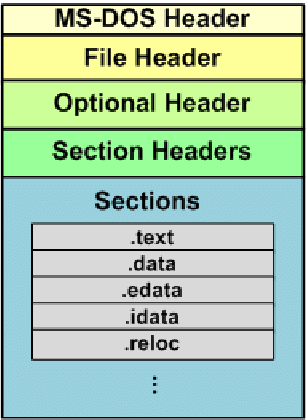
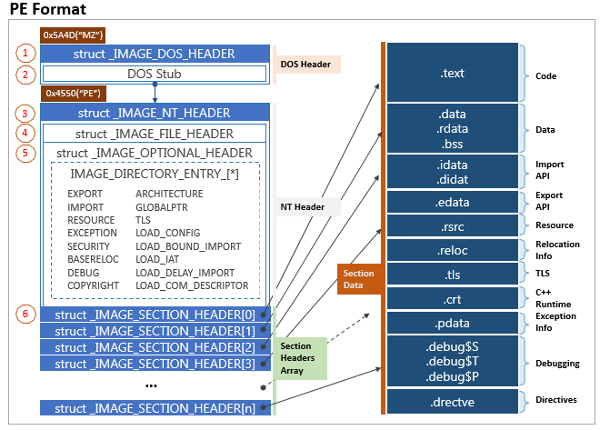
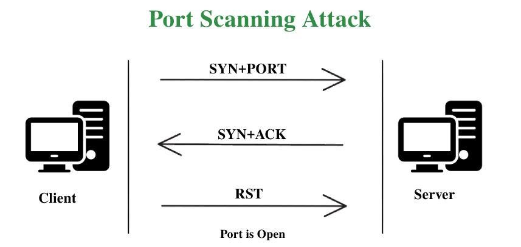
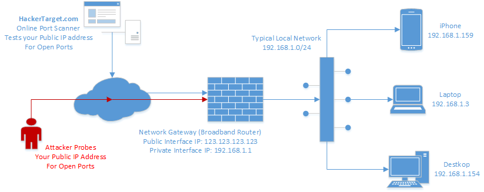
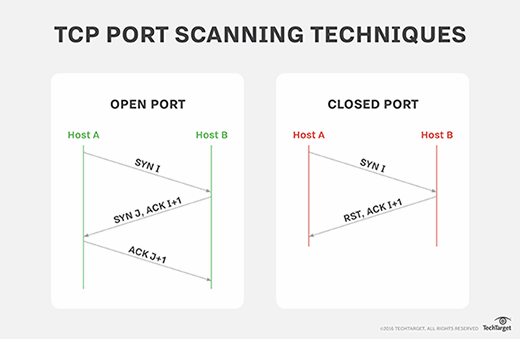

# CySentry

The System Compromised Checker is a critical tool in the realm of cybersecurity, designed to assess and evaluate the integrity of computer systems. In an era where digital threats loom large, this checker plays a pivotal role in identifying potential vulnerabilities and unauthorized access points that could jeopardize the security of sensitive information. 

This tool operates by meticulously scrutinizing the system's configurations, network connections, and software components. It seeks out anomalies, irregularities, or any signs of compromise that may indicate a security breach. The System Compromised Checker employs sophisticated algorithms and signature-based detection methods to compare system attributes against known patterns of malicious activities. By regularly employing this checker, organizations can fortify their defenses and proactively address potential security lapses before they escalate into full-blown breaches. It serves as a preemptive measure, offering a layer of protection against a myriad of cyber threats,as of now it includes network snooping install and PE file malware .

 In conclusion, the System Compromised Checker is a linchpin in the ongoing battle to safeguard digital infrastructures. Its role in continuous monitoring and early threat detection empowers organizations to maintain the integrity of their systems and preserve the confidentiality, availability, and integrity of their critical data.

# Description (In-depth)

CySentry is a project to tackle the common Cyberattacks and intrusion of system faced by common people and industries.

Cysentry focusses on ML being an alternative which is reliable in detecting malware,
Our idea of the project is to detect compromises(intrusion) by means of Machine Learning algorithms. 
Malwares consistently change but more or less have similar functions.
We train our Machine Learning modals with those features , so we can deal with those intrusions.

As of now our app covers 2 types of intrusions:
1) PE file malwares (.dll,.exe,etc)
2) Portscan Attacks on Network

We chose these 2 fields to cover a broader range, PE files primarily deals with localized storage
while the Portscan attacks deals with networking and is not just limited to files in a computer. 

## PE Files:

PE files were chosen by our team as majority of computers have executable files and DLL files. There are innumerable applications which are executed many times on a particular system and hence due to the popularity, it is a very widespread medium to pass and spread malware.
We parse only the PE header information. Here is the image of the PE file structure to better understand it :

We designed models encompassing the static features of PE files such as the NT_HEADERS, DOS_HEADERS, the various sections like .text,.data,.rcsc and their entropy values. The other models also accounted various DLLs imported by the PE file and the nature of the functions imported by them by decoding their names and finalizing the classification.

We used a combination probability of 5 perfectly designed, trained and tested models to classify a file into three tiers:

1) Goodware (if majority prediction is ‘0’)
2) Malware(if majority prediction is ‘1’)
3) Inconclusive (if majority prediction is malware through 3-2 tie in malware vs non-malware classification)
The third tier was introduced to reduce the number of false positive rates!

## Port Scan:

Port scanning is a technique used to discover open ports on a computer system. Ports are communication endpoints used by software to enable network services. Each port is associated with a specific service or application.

This is the first step towards any network attack. Its the reconnaisance of the hackers. 

This information is valuable for various reasons, including network security assessments, troubleshooting, and vulnerability analysis. By understanding which ports are open, administrators can ensure that only necessary services are running and identify potential security risks.

Port scanning involves sending network requests to a range of ports on a target system and analyzing the responses. There are different types of port scans, including:

TCP Connect Scan: This type establishes a full TCP connection to the target port. If successful, it indicates that the port is open.

SYN Scan (Half-Open Scan): This scan sends SYN packets to the target ports without completing the three-way handshake. It is faster than a TCP connect scan.

This was formerly known as stealth scan. But it isnt comparatively more stealthy to other portscans, it was named so based on the notion that since it doesnt return back a RESET flag and immediately disconnects after receiving response.

The "three-way handshake" is a fundamental process in establishing a TCP (Transmission Control Protocol) connection between two networked devices. It is a reliable and connection-oriented protocol that ensures the orderly and secure exchange of data. The three-way handshake involves three steps:

## SYN (Synchronize):

The initiating device, usually referred to as the client, sends a TCP packet with the SYN (synchronize) flag set to the server.
The packet includes an initial sequence number (ISN) that helps in uniquely identifying each byte of data.
SYN-ACK (Synchronize-Acknowledge):

Upon receiving the SYN packet, the server responds with a TCP packet that has both the SYN and ACK (acknowledge) flags set.
The server also selects its own initial sequence number (ISN) and includes it in the response.
The acknowledgment number (ACK) is set to the client's ISN plus one, indicating that the server is ready to receive data starting from the client's next expected sequence number.
ACK (Acknowledge):

Finally, the client acknowledges the server's response by sending a TCP packet with the ACK flag set.
The acknowledgment number (ACK) is set to the server's ISN plus one, indicating that the client is ready to receive data starting from the server's next expected sequence number.
Once the three steps are completed, the TCP connection is considered established, and both devices can begin bi-directional communication. The three-way handshake helps ensure that both the client and server are synchronized, agree on the initial sequence numbers, and acknowledge each other's readiness to exchange data.

This process is crucial for the reliable and ordered transmission of data over a TCP connection, providing features such as error checking, flow control, and congestion control. Additionally, the three-way handshake helps prevent old or duplicate connection initiation attempts from causing confusion in the communication process.

# Getting Started
## Dependencies:

Wireshark needs to be downloaded (includes Tshark) : https://www.wireshark.org/download.html

Npcap needs to be downloaded : https://npcap.com/#download

Though when we convert this into an executable file, all the libraries also get wrapped into it.
But these are the mentions of the libraries used, we have written the means of downloads for 3rd party python libraries
(We will be uploading the exe file on the website soon)

Python Libraries:(installed using pip):
Numpy Pandas OS Joblib Warnings Subprocess Time Pefile Flet 

OS:
1) Windows 7
2) Windows 10
3) Windows 11
(all versions of these windows, including windows 7 proffessional)

## Installing:

Website: https://cysentry.vercel.app

No modifications need to be made, just run the executable after downloading from the website

## Executing Program without App:

1) Unzip FINAL_DONTKOW20 zip file an extract it.

2) Open the "CySentry.py" and run the file using python.

3) The App's GUI appears and then you can use it.

## Authors:

1) Ramachandra Bharadwaj- sriramch2005@gmail.com

2) Somanath - somanathnayak1304@gmail.com

3) Anurag - anuragnarsingoju@gmail.com

4) Srisai - srisaisagarla@gmail.com

5) Pranav - pranavdingary@gmail.com

6) Suchith

Version History:

    0.1 - Initial Release

Acknowledgments:

    Research Papers:
    https://aircconline.com/ijnsa/V14N3/14322ijnsa02.pdf
    https://www.scitepress.org/papers/2018/66398/66398.pdf
    https://arxiv.org/abs/2212.13988

    Github:
    https://github.com/CanadianInstituteForCybersecurity/CICFlowMeter

    Documentation:
    https://flet.dev/docs/guides/python/getting-started/
    https://www.wireshark.org/docs/man-pages/tshark.html
    https://pefile.readthedocs.io/en/latest/modules/pefile.html

